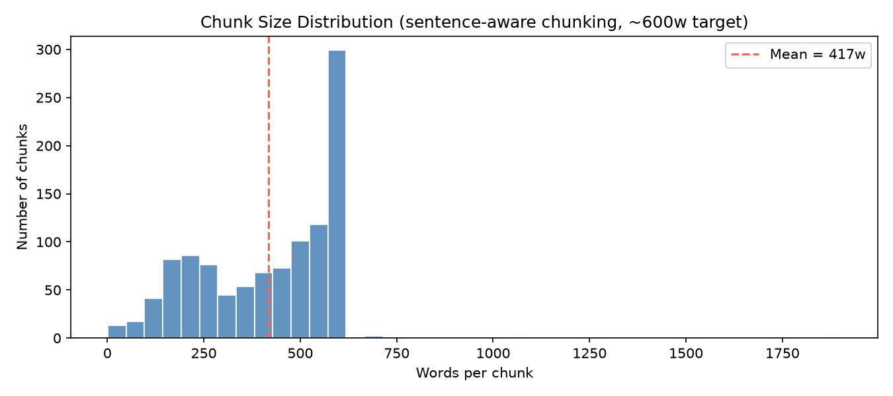
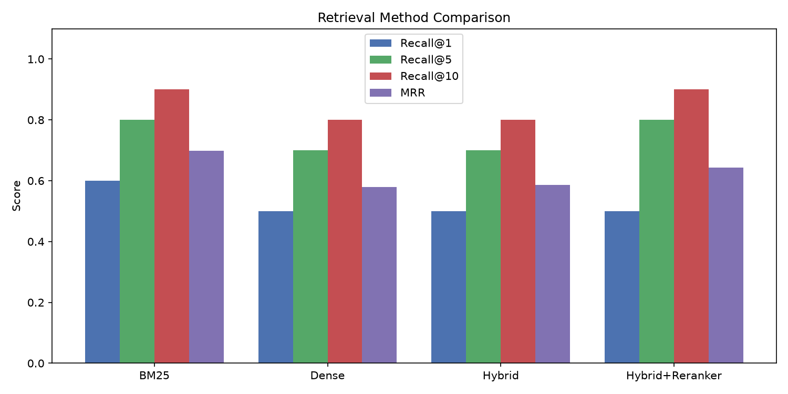
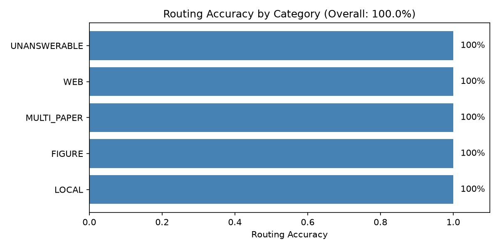

# Adaptive Multimodal RAG — Research Paper Assistant
### Ishan Jawale · Plaksha University Capstone 2026

---

# Part 1 — What I Built

## The Problem

Standard RAG systems are brittle. They do three things badly:

1. **Keyword mismatch** — Vector search misses rare acronyms. BM25 misses conceptual queries.
2. **No images** — PDFs contain architecture diagrams drawn as vectors. Standard extractors throw them away.
3. **Static knowledge** — They can never answer questions about events after their papers were published.

## What I Built — The Full Pipeline

```
User Question
     │
     ▼
┌─────────────────────────────┐
│      LLM Query Router       │  ← Gemini classifies: LOCAL / WEB / BOTH
│   (src/routing.py)          │    + Intent: FACT, COMPARISON, FIGURE...
└──────────────┬──────────────┘
               │
       ┌───────┴───────┐
       ▼               ▼
 LOCAL Path        WEB Path
       │               │
       ▼               └──→ Tavily Search API (live web)
┌─────────────────┐
│  Hybrid Search  │  ← Dense (MiniLM) + BM25, union of top-20 each
│ (src/retrieval) │
└────────┬────────┘
         │
         ▼
┌─────────────────┐
│ Cross-Encoder   │  ← ms-marco-MiniLM re-scores all candidates jointly
│   Reranker      │    with the query, picks Top 5
└────────┬────────┘
         │
         ▼
┌─────────────────┐
│ Figure Retrieval│  ← Scores all extracted diagrams from top paper
│ (src/figures)   │    Caption match + paper bonus + score gating
└────────┬────────┘
         │
         ▼
┌─────────────────┐
│  Gemini 3.5     │  ← Gets: question + top 5 text chunks + diagram image
│  Flash (LLM)    │    Returns: grounded answer with citations
└─────────────────┘
```

## Technology Stack

| Layer | Tool | Why |
|---|---|---|
| **Embeddings** | `all-MiniLM-L6-v2` (384-dim) | Fast, lightweight, strong semantic retrieval |
| **Dense Search** | NumPy cosine similarity | Sufficient for a 30-paper corpus; zero overhead |
| **Sparse Search** | BM25Okapi (`rank-bm25`) | Handles exact acronyms — LoRA, RAPTOR, HyDE |
| **Reranker** | `ms-marco-MiniLM-L-6-v2` (Cross-Encoder) | Full attention over query+chunk pair; high precision |
| **Web Fallback** | Tavily Search API | Real-time external knowledge for temporal queries |
| **LLM & Vision** | `gemini-3.5-flash` | Native multimodal; image + text in a single prompt |
| **PDF Parsing** | `PyMuPDF` + regex caption detection | Captures both raster and vector diagrams |
| **UI** | Streamlit | Chatbot interface with chat history |
| **Citation Scores** | OpenAlex API | Citation counts for source credibility scoring |

## How Each Component Works

### 1. Chunking — Sentence-Aware (`src/ingestion.py`)

```python
# NLTK tokenizes at sentence boundaries, then we accumulate words
sentences = sent_tokenize(text)
current_chunk, current_count = [], 0

for sentence in sentences:
    words = sentence.split()
    if current_count + len(words) > TARGET_WORDS and current_chunk:
        yield " ".join(current_chunk)
        # Slide window by keeping the last OVERLAP_WORDS of context
        overlap = " ".join(current_chunk).split()[-OVERLAP_WORDS:]
        current_chunk = overlap + words
        current_count = len(current_chunk)
    else:
        current_chunk.extend(words)
        current_count += len(words)
```

### 2. Hybrid Retrieval (`src/retrieval.py`)

```python
def search(self, query: str, top_k: int = 20) -> list[dict]:
    # Dense: encode query → cosine similarity over all 384-dim embeddings
    dense_results = self.dense.search(query, top_k=top_k)

    # Sparse: BM25 TF-IDF scoring over tokenized corpus
    bm25_results  = self.bm25.search(query, top_k=top_k)

    # Union — deduplicate by chunk_id, preserving best-scored copy
    seen, merged = set(), []
    for chunk in dense_results + bm25_results:
        if chunk["chunk_id"] not in seen:
            seen.add(chunk["chunk_id"])
            merged.append(chunk)
    return merged
```

### 3. Cross-Encoder Reranking (`src/reranking.py`)

```python
# Pairs EVERY candidate with the query and runs full cross-attention
pairs  = [[query, chunk["text"]] for chunk in candidates]
scores = self.model.predict(pairs)   # CrossEncoder returns raw logits

for chunk, score in zip(candidates, scores):
    chunk["rerank_score"] = float(score)

# Sort by rerank score — negative means irrelevant
return sorted(candidates, key=lambda x: x["rerank_score"], reverse=True)[:top_k]
```

### 4. LLM Query Routing (`src/routing.py`)

```python
ROUTER_SYSTEM_PROMPT = """
You are a query-routing assistant for a RAG system.
The local corpus contains 30 academic papers on RAG, LLMs, and retrieval.

Classify the question into:
  INTENT  : LOCAL_FACT | COMPARISON | FIGURE | CURRENT_INFORMATION | BROAD_RESEARCH
  SOURCE  : LOCAL | WEB | BOTH
  MODALITY: TEXT | IMAGE | TEXT_AND_IMAGE

RULES:
- Default to LOCAL unless there is a clear signal for WEB.
- Questions with "latest", "2025", "2026", "price", "news" → WEB or BOTH.
- Questions about "Figure X", "the diagram in" → FIGURE + IMAGE modality.

Return ONLY valid JSON:
{ "intent": "...", "source": "...", "modality": "...", "reasoning": "..." }
"""

# Automatic confidence-based fallback:
def needs_web_fallback(reranked_chunks, threshold=0.0):
    # Cross-encoder score below 0 = mathematically irrelevant
    top_score = reranked_chunks[0].get("rerank_score", -999)
    return top_score < threshold
```

### 5. Score-Gated Figure Retrieval (`src/figures.py`)

```python
def _papers_from_chunks(chunks):
    paper_counts = {}
    for rank, chunk in enumerate(chunks):
        # Skip web sources and chunks the reranker deemed irrelevant
        if chunk.get("paper_id") == "web" or chunk.get("rerank_score", 1.0) < 0.0:
            continue
        weight = 1.0 / (rank + 1)   # higher rank = more weight
        paper_counts[chunk["paper_id"]] += weight

    return sorted(paper_counts, key=lambda p: paper_counts[p], reverse=True)

# Figure scoring: caption match + paper bonus + figure mention
# Minimum threshold of 10 — below this, return no figure at all
if best_score < 10:
    return []
```

### 6. Citation Credibility Scoring (`src/credibility.py`)

```python
# Log-scale normalisation — Attention Is All You Need (7,290 cites) = 96.6/100
# A paper with 100 cites = 51.2/100, keeping the scale fair

def _normalize(citation_count):
    return (math.log10(citation_count + 1) / math.log10(10_001)) * 100.0

# Aggregate: rerank_score-weighted average across all retrieved chunks
def aggregate_credibility(chunks, citations):
    scored_pairs = []
    for chunk in chunks:
        if chunk.get("retrieval_type") == "web":
            continue   # web sources excluded from academic credibility score
        cred   = get_paper_credibility(chunk["paper_title"], citations)
        weight = max(chunk.get("rerank_score", 1.0), 0.01)
        scored_pairs.append((weight, cred["score"]))

    total_weight = sum(w for w, _ in scored_pairs)
    return sum(w * s for w, s in scored_pairs) / total_weight
```

---
---

# Part 2 — What I Found

> Evaluation benchmark: **30 ground-truth questions** across 5 categories  
> Local Fact · Multi-Paper Comparison · Web/Temporal · Figure/Visual · Unanswerable

---

## Corpus Statistics

| Stat | Value |
|---|---|
| Papers ingested | 30 |
| Total chunks | 1,078 |
| Average words per chunk | 417 |
| Total figures extracted | 382 (97 bitmap + 285 vector-rendered) |
| Embedding dimensions | 384 (MiniLM-L6-v2) |

---

## Finding 1 — Chunking Strategy

Naive word-count splitting severs sentences mid-way, breaking formulae and citations across chunk boundaries. Switched to **NLTK sentence-aware chunking** with a 600-word target and a 100-word overlap.

The result is a clean, bell-shaped distribution — no extreme outliers, no truncated equations, no split references.



---

## Finding 2 — Retrieval Evaluation

Four strategies evaluated against 10 questions with known ground-truth papers:

| Method | Recall@1 | Recall@5 | Recall@10 | MRR |
|---|---|---|---|---|
| BM25 | 60% | 80% | 90% | 0.698 |
| Dense (baseline) | 50% | 70% | 80% | 0.579 |
| Hybrid | 50% | 70% | 80% | 0.586 |
| **Hybrid + Reranker** | **50%** | **80%** | **90%** | **0.643** |



### The BM25 Paradox

BM25 scored almost identically to Hybrid + Reranker. Academic papers contain highly specific, rare acronyms (*LoRA*, *Self-RAG*, *RAPTOR*, *HyDE*) — BM25's IDF weights these extremely heavily, so *"What is RAPTOR?"* finds the paper at Rank 1 immediately.

However, BM25 **completely fails** on conceptual queries like *"How do I reduce hallucinations without fine-tuning?"* because none of those words appear verbatim in the Self-RAG paper. The **Cross-Encoder Reranker** understands semantic meaning — both are needed.

---

## Finding 3 — Query Routing Accuracy

The LLM router was evaluated against all 30 benchmark questions:

- ✅ **100% routing accuracy** (30/30 correct)
- ✅ **0 unnecessary web searches** fired for local questions
- ✅ **0 missed web searches** for temporal or external queries



---

## Finding 4 — Vector Figure Extraction

Standard PDF libraries (`PyMuPDF.get_images()`) only capture **embedded raster bitmaps**. Academic architecture diagrams are drawn as **vector graphics** — lines, boxes, arrows — which are completely invisible to standard extractors.

Implemented a fallback renderer:
1. Scan each page for `Figure X` caption patterns using regex
2. Render full page at 150 DPI using `page.get_pixmap()`
3. Apply quality filter to reject blank pages and thin divider lines

**Result:** 285 vector diagrams extracted that would otherwise be lost.

**Example — CRAG Inference Architecture (Page 4):**


---
---

# Part 3 — One Thing I'd Do Differently

---

## 1. The Core Architectural Flaw: Text-Based Image Retrieval

The biggest limitation of this system is that **it uses text metadata to retrieve images, rather than visual understanding**.

### How Image Retrieval Currently Works:
Image retrieval currently searches `data/figures.json`—a pure text database of captions and paper titles:
1. It looks at the top-ranked *text chunks* and awards a paper bonus (+30 pts) to figures from that paper.
2. It matches words between the user query and the *figure caption* (+3 pts per word).
3. The image pixels themselves are **never searched or embedded**. The system only opens the image at the very end when sending it to Gemini.

```
Current Flow:
User Query ──(Text Search)──► Top Text Chunks ──(Paper ID)──► Caption Match in figures.json ──► Pick Figure
                                                                ▲
                                            No visual understanding here!
```

### Why Text-Based Image Retrieval Fails:
1. **Captions don't describe visual content:** Academic captions are notoriously brief (e.g., *"Figure 1: System overview"* or *"Figure 4: Ablation results"*). They rarely describe what is actually drawn (e.g., *"flowchart with feedback loop"*, *"attention heatmaps"*, or *"bar chart comparing latency"*).
2. **Visual queries fail:** If a user asks *"Show me the flowchart comparing retriever vs generator"* or *"Show me the loss curve graph"*, caption matching fails because the visual descriptors (*"flowchart"*, *"loss curve"*) do not appear in the text.
3. **Images are treated as second-class attachments** to text chunks, rather than first-class retrievable knowledge.

---

## 2. The Symptom: The "Forced Retrieval" Bug

Because image search was piggybacked onto text chunks, it created an ugly engineering bug during testing:

* **Query:** *"Tell me about the Mahabharata."* (An off-topic query with zero relevant papers).
* **The Failure:** Dense text retrieval was mathematically forced to return the closest vector (a weak passage from GPT-3). The figure retriever saw GPT-3 at Rank 1, awarded it a massive +30 paper bonus, and confidently surfaced a **GPT-3 Few-Shot Learning diagram** for a question about an ancient epic.

### Our Temporary Patch (Heuristics):
We patched this symptom using Cross-Encoder score gating:

```python
# In src/figures.py — heuristics to suppress forced false-positive images
for rank, chunk in enumerate(chunks):
    # If the cross-encoder deemed the text chunk irrelevant (logit < 0), drop paper bonus
    if chunk.get("rerank_score", 1.0) < 0.0:
        continue

# If the best candidate figure scores below 10, return nothing
if best_figure_score < 10:
    return []
```

> **The Insight:** This patch stopped the symptom, but it didn't cure the disease. The root cause is that **we used text to search for images**.

---

## 3. What I Would Do Differently: Native Visual Embeddings (CLIP / ColPali)

Instead of searching captions in `figures.json`, the principled solution is **true multimodal retrieval**:

1. **Offline Ingestion:** Pass each extracted diagram through a vision-language embedding model (**CLIP** or **ColPali**) to encode the actual image pixels into an image vector space.
2. **Online Query:** Run parallel, decoupled retrievers:
   - User query $\rightarrow$ **Text Vector Search** $\rightarrow$ Top 5 text passages.
   - User query $\rightarrow$ **Image Vector Search** $\rightarrow$ Top diagram (matched on visual semantics).
3. **Fuse at Generation:** Send both the best text chunks and the best visual diagram to the multimodal LLM.

```
Principled Multimodal Flow:
                            ┌──► Text Embeddings ──► Top Text Chunks ──┐
                            │                                          │
User Query ──► Joint Model ─┤                                          ├──► Multimodal LLM (Gemini)
                            │                                          │
                            └──► Image Embeddings ─► Top Figure ───────┘
                                 (Searches pixels, not captions!)
```

### Why This is Better:
- **Visual understanding:** Queries like *"Show me the transformer encoder-decoder flowchart"* will match the visual structure of the diagram itself, even if the caption is just *"Figure 1"*.
- **Completely decoupled:** An off-topic question simply gets a low cosine similarity in *both* vector spaces, naturally returning no image without needing artificial score thresholds.

---

## 4. Future Roadmap & Key Enhancements

### ① Native Multimodal Retrieval (Fixing Text-Based Image Search)
Replace caption-keyword search with **ColPali** or **CLIP** embeddings. Directly encode PDF figure pixels into an image vector store so that diagrams are retrieved by visual semantics (flowcharts, architecture blocks, curves) rather than incomplete text captions.

### ② Multi-Turn Conversation History for Context
Currently, each query is processed independently in a single turn. Adding conversation memory with conversational query reformulation (condensing conversation history into a contextualized search query) will allow natural research follow-ups, such as:
* *"Can you explain the feedback loop in that diagram?"*
* *"How does its loss function compare to the first paper you mentioned?"*

### ③ Agentic Query Reformulation & Corrective Retrieval
Allow the system to dynamically recognize weak retrieval instead of a one-shot pass:
* If reranker logits indicate marginal or ambiguous relevance, an agentic loop critiques the retrieved chunks.
* The system actively **reformulates the query** into alternative keywords, decomposes complex questions into sub-queries, and executes an iterative second retrieval pass (inspired by CRAG).

### ④ Self-Evaluating RAG (Hallucination Verification Loop)
Implement an automated critique layer before presenting answers to the user (inspired by *Self-RAG* and *Chain-of-Verification*):
* Every generated claim is broken down and verified against the retrieved evidence chunks.
* If a claim is unsupported or contradicts the text/figure, the self-evaluator either rejects the claim, flags it with an epistemic confidence warning, or triggers targeted retrieval to confirm it.

### ⑤ GraphRAG for Cross-Paper Comparative Synthesis
Construct an entity-relationship knowledge graph across all ingested papers at ingestion time. This captures citation networks, shared benchmarks, and methodology families, enabling deep comparative analysis across multiple papers.

### ⑥ Fully Quantized Air-Gapped Edge Deployment
Deploy local multimodal models (such as `llama3.2-vision`) via **llama.cpp** with 4-bit quantization to achieve sub-5-second local inference—offering privacy-preserving, offline research assistance for proprietary or embargoed documents.
